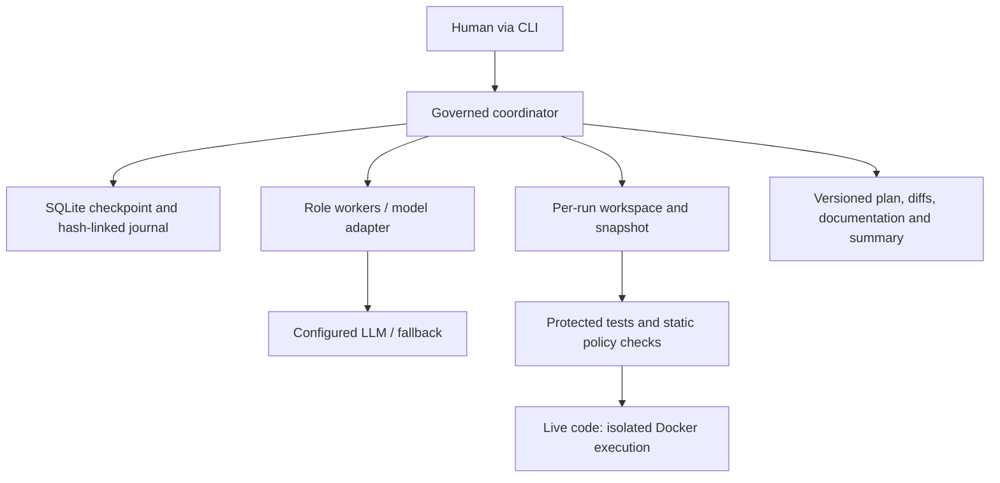
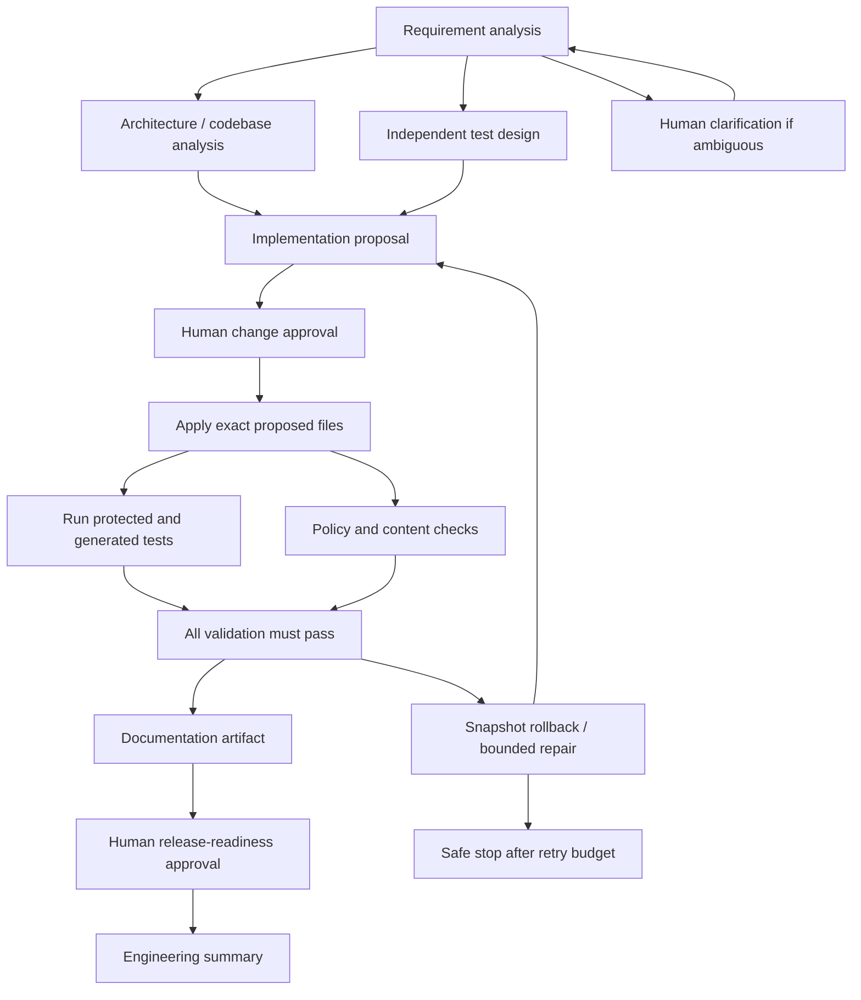

# Architecture and control model

## System boundaries

The engineering control plane (`orchestrator`) and delivered business application
(`shortener`) are separate. The CLI is the trusted human interface. The model
cannot invoke approvals, choose shell commands, install packages or deploy.
Its outputs are data contracts that the deterministic coordinator validates.

## Dependency graph and non-linear paths

`GRAPH` is the explicit executable dependency map, validated for unknown
dependencies and cycles. The scheduler starts all ready nodes together in a
thread pool, waits for every worker in the batch, and persists outputs centrally.
Implementation cannot start until architecture and test design finish.
Documentation cannot start until both tests and security pass.

## State machine

`created/ready -> running -> waiting_clarification | waiting_approval | completed | stopped`

Only the human CLI can resolve a pending approval. Approval binds to a SHA-256
digest of requirement, revision, prior outputs and workspace. A different patch,
new requirement, or changed file invalidates approval. Every release approval
also requires the current workspace to match the validation hash.

Exit gates check nonempty structured outputs, model role schemas, allowed paths,
parseable Python, test results and content hashes. Entry gates are dependency
completion, current revision, change authorization and baseline integrity.

## Context and decision lineage

Every role reads the normalized requirement and relevant preceding outputs.
Architecture records source hashes and Python AST function/class inventories;
the implementation role receives source, test plan, architecture, and failed-test
feedback. Each node completion event records hashes of its direct inputs and
output. JSON artifacts are retained per revision, and the event journal preserves
superseded revisions. No private chain-of-thought is requested or stored; rationale
means concise engineering decisions and evidence.

## Re-planning

Two different transitions are implemented:

1. Failed validation restores the baseline and invalidates implementation and
   all downstream nodes. Requirements, architecture and test design remain valid.
   Repair feedback is supplied to the next implementation proposal. A fresh
   change approval is required. Initial attempt plus two repairs is the maximum.
2. A human changes requirements or supplies clarification. The coordinator
   increments revision, restores baseline, clears all approvals and re-runs all
   nodes. Conservative invalidation is deliberate for this small graph. Live
   roles regenerate task content; fixture mode accepts only its scenario contract.

The lifecycle topology is policy-controlled, not invented by the model. Arbitrary
graph mutation is intentionally outside prototype scope. Execution is non-linear
because of parallel branches, pause/resume, clarification and repair loops.

## Failure recovery and bounded autonomy

- HTTP model calls: timeout 45 seconds, maximum three attempts per configured
  provider, exponential waits of 1 and 2 seconds, then optional second provider.
- Authentication/client errors skip retry for that provider. Responses are
  bounded and must parse as JSON. Redirects are refused to protect credentials.
- No configured/working provider: safe stop, never covert fixture fallback.
- Validation process: 90-second timeout; live container forcibly removed on exit.
- Dependency transitions: 40 iterations per invocation.
- Crash mid-operation: state remains `running`. `recover` explicitly restores
  snapshot and invalidates approvals instead of blindly replaying side effects.
- Concurrent CLI writers: exclusive lock serializes one coordinator per root.
- File writes: only four allowlisted files for greenfield, one policy module for
  enhancements; no model-supplied commands or filenames outside that scope.

## Decisions (ADRs)

| Decision | Rationale | Trade-off / next step |
|---|---|---|
| Python standard library / WSGI | Offline reproducibility, minimal installation, transparent control code | Minimal HTTP adapter; use production WSGI server and richer schema middleware before hosting |
| Custom small DAG coordinator | Explicit gates and state transitions are easy to review in a short assignment | More custom code; a durable workflow framework is preferable at larger scale |
| SQLite | Local ACID checkpoints and transactional click accounting | One writer at a time; migrate to PostgreSQL and an external queue for distributed workers |
| Independent protected tests | Developer cannot fix tests to hide failed code | Not a full adversarial verifier; root user can still edit local test files |
| Separate fixture and live modes | Reliable offline demonstration without misrepresenting model calls | Offline replay is not proof of live model quality |
| Snapshot rollback | Works without destructive Git commands; isolated run directories | Source rollback only, not a production database rollback |
| Conservative revision invalidation | Stale approvals cannot survive changes | Recomputes some unaffected nodes |
| Human-operated CLI | Small attack surface; no unattended high-impact authorization | Local actor name is attribution, not enterprise identity verification |

## Scaling path

Replace SQLite with PostgreSQL, add durable task leases and idempotent jobs,
replace the local reviewer identity with SSO/RBAC, use disposable sandbox workers,
sign audit events and anchor them in externally immutable storage. Add real SAST,
dependency scanning, load tests and approved CI/CD release integrations. These
are future hardening tasks, not silently claimed features.
